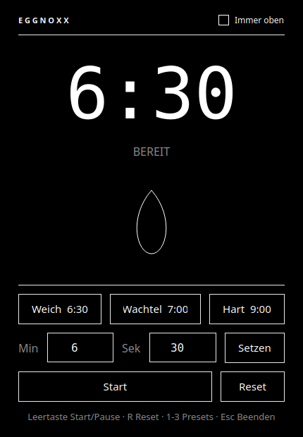

# 🥚 EggNoxx

Eine minimalistische Eieruhr in Schwarz-Weiß. Keine Farben, keine Gradienten,
keine Schnickschnacks — nur ein Ei, das sich füllt, und eine große Uhr.



## Features

- **Presets**: Weich 6:30 · Wachtel 7:00 · Hart 9:00
- **Freier Timer** mit Minuten- und Sekundeneingabe
- **Das Ei füllt sich** während des Kochens und wird am Ende komplett weiß
- **Alarm** aus Signalton und blinkender Schwarz-Weiß-Invertierung des ganzen Fensters
- **Immer-im-Vordergrund** für den Blick über den Herd
- Läuft auch minimiert weiter, beim Schließen wird nachgefragt

## Bedienung

| Taste | Funktion |
| --- | --- |
| `Leertaste` | Start / Pause |
| `R` | Reset |
| `1` `2` `3` | Preset Weich / Wachtel / Hart |
| `Alt` + `T` | Immer im Vordergrund umschalten |
| `Esc` | Beenden |

## Installation

```bash
python3 -m venv .venv
source .venv/bin/activate
pip install pyside6
```

## Starten

```bash
python -m eggnoxx
```

Alternativ nach `pip install -e .` als `eggnoxx`.

## Entwicklung

```bash
pip install -e ".[dev]"

pytest              # 21 Logik-Tests, ohne GUI
ruff check .
ruff format .

python smoke_test.py           # GUI-Test headless (offscreen) + Screenshots
python smoke_test.py --visible # Fenster wirklich anzeigen
```

### Aufbau

| Datei | Inhalt |
| --- | --- |
| `eggnoxx/core.py` | Timer-Logik ohne Qt — driftfrei über `time.monotonic()` |
| `eggnoxx/theme.py` | Farben, Fonts, Stylesheet (dunkel/hell für den Blink) |
| `eggnoxx/egg.py` | Das Ei, gezeichnet mit `QPainter` |
| `eggnoxx/alarm.py` | Signalton und Blink-Logik |
| `eggnoxx/window.py` | Hauptfenster, Presets, Tastaturkürzel |

Die Logik in `core.py` kommt bewusst ohne Qt aus, damit sie direkt testbar ist:
ein `Countdown` rechnet immer gegen eine Deadline, nie gegen aufsummierte
Ticks — so kann die Uhr nicht driften.

## Anforderungen

Python 3.10+ und PySide6 (getestet mit Python 3.14 und PySide6 6.11).